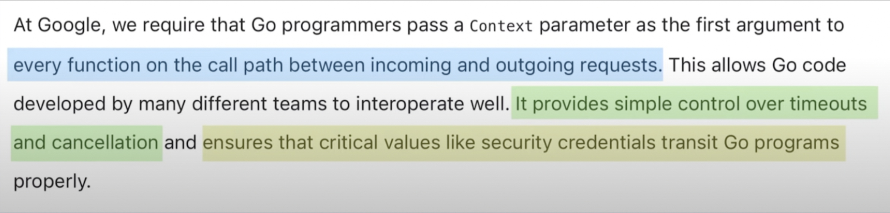

## Контексты в Go
- контексты иммутабельны - можно создать новый на основе существующего - сделано это для того чтобы дочерние функции не могли на него повлиять


- Всегда передается первым параметром, соглашение
-----
Максимальное кол-во горутин, которое может исполняться - кол-во ядер

```go
runtime.NumCPU() // кол-во логических ядер
```

Можно ограничить число одновременных горутин через

```go
runtime.GOMAXPROCS(1)
```

Можно вручную попросить планировщик переключиться на другую горутину

```go
runtime.Goshed()
```

Способ синхронизировать горутины - каналы и пакет sync.

-----

defer функции вызываются в обратном порядке

-----

sync.Mutex - эксклюзивная блокировка, если взят Lock, то никто не имеет доступа к ресурсу, нельзя даже читать
sync.RWMutex - не эксклюзивная, читать на RLock могут все, но читать когда взят Lock не могут

-----

Запись в закрытый канал вызовет панику
Чтение из закрытого канала - возможно, будет возвращено дефолтное значение

```go
v, ok <- closedChan
```

------
Сравнение скорости блокировки через Mutex и Канал, атомики.

```sh
BenchmarkMX/mutex-8 7194 172926 ns/op 32058 B/op 1003 allocs/op
BenchmarkMX/channel-8 3838 316418 ns/op 32920 B/op 1010 allocs/op
BenchmarkMX/atomic-8 7618 161830 ns/op 24020 B/op 1002 allocs/op
```

```go
func BenchmarkMX(b *testing.B) {
	b.Run("mutex", func(b *testing.B) {
		for i := 0; i < b.N; i++ {
			mutex()
		}
	})

	b.Run("channel", func(b *testing.B) {
		for i := 0; i < b.N; i++ {
			channel()
		}
	})

	b.Run("atomic", func(b *testing.B) {
		for i := 0; i < b.N; i++ {
			atom()
		}
	})
}

func mutex() {
	counter := 0
	mx := sync.Mutex{}
	wg := sync.WaitGroup{}
	wg.Add(1_000)
	for i := 0; i < 1_000; i++ {
		go func() {
			defer wg.Done()
			defer mx.Unlock()
			mx.Lock()
			counter += 1
		}()
	}
	wg.Wait()
} 

func channel() {
	counter := 0
	ch := make(chan struct{}, 1)
	wg := sync.WaitGroup{}
	wg.Add(1_000)
	for i := 0; i < 1_000; i++ {
		go func() {
			defer wg.Done()
			ch <- struct{}{}
			counter += 1
			<-ch
		}()
	}
	wg.Wait()
}

func atom() {
	counter := atomic.Int32{}
	wg := sync.WaitGroup{}
	wg.Add(1_000)
	for i := 0; i < 1_000; i++ {
		go func() {
			defer wg.Done()
			counter.Add(1)
		}()
	}
	wg.Wait()
}
```

-----

Массив не обязательно будет находиться в одном месте в памяти, он может переезжать во время исполнения, например по мере роста стека горутины.

-----

Начиная с go 1.22 в range цикле каждый раз создается новая переменная с уникальным адресом, позволяя избежать проблемы с замыканием.

-----

Если размер массива больше 10 мб, то он будет аллоцирован в куче
Также может размещаться в куче в следствии escape analysis, например, при возврате ссылки на массив из функции

Срезы аллоцируются в стеке, если их размер <= 64кб. При реаллокации, даже небольшого массива новая память выделяется на куче.

-----

Массив, как и все в Go копируется при передаче в функцию. Для избежания этого, если массив большой стоит передавать по ссылке либо использовать слайсы.

-----

Как работают массивы под капотом

![[Screenshot 2024-10-13 at 01.05.40.png]]

-----

При обращении к элементу в слайсе большим, чем его длина - будет паника, даже если capacity позволяет

```go
s := make([]int, 3, 6);
s[4] // panic
```

------

append и range по nil-слайсу - корректная операция

```go
var s []int
for range s {} // ok
append(s, 1) // ok
```

----

Рост слайсов. Емкость среза никогда не уменьшается автоматически.

![[Screenshot 2024-10-13 at 14.38.18.png]]

-----

Можно ли изменить строку?

```go
s := []byte("hello world")
pointer := unsafe.SliceData(s)
str := unsafe.String(pointer, len(s))

println(str)
s[0] = '-'
println(str)
```

-----

При использовании range указанное выражение вычисляется 1 раз перед началом цикла. Поэтому добавление элементов в слайс не приведет к бесконечному циклу. При итерировании по слайсу будет скопирован объект структуры (массив при этом не копируется).

**Нужно быть осторожным при использовании range с массивами**
Если range по массиву - то так же происходит копирование, что может быть дорогостоящим, если массив большой.

```go
data := [...]int{1, 2, 3}

for v := range data {} // массив data будет скопирован
for v := range &data {} // массив не копируется
for v := range data[:] {} // массив не копируется
```

------

append при добавлении элемента к слайсу может перетереть исходных слайс

```go
a := []int{1, 2, 3} // [1, 2, 3]
b := a[1:2]         // [2]

b = append(b, 4)

// a = [1, 2, 4]
// b = [2, 4]
```

------

Способы очистки слайсов

```go
first := []int{1, 2, 3}
first = nil // полностью зануляем, теряя емкость

second := []int{1, 2, 3}
second = second[:0] // сохраняем аллоцированную память

third := []int{1, 2, 3}
third = clear(third) // zero-value всем элементам

clear(third[1:3]) // частичное зануление
```

----

Срезы можно сравнивать с помощью `slices.Equal(a, b)`.
Другой вариант через `reflect.DeepEqual(a, b)`. Особенность этого сравнения в том, что оно будет рекурсивно. Различает пустые и нулевые срезы. Достаточно медленно работает.

-----

Для того чтобы скопировать срез можно использовать функцию `copy`

```go
src := []int{1, 2, 3}
dst := make([]int, 3)
copy(src, dst)
```

Особенность функции в том, что кол-во элементов для копирования будет `min(len(src), len(dst))`. Соответственно следующий пример будет работать не так как ожидалось.

```go
src := []int{1, 2, 3}
var dst []int
copy(src, dst)
```

Третий вариант - использовать клонирование из стандартной библиотеки

```go
src := []int{1, 2, 3}
dst := slices.Clone(src);
```

------


------


## Toolchain
## sync.Cond
## Реализация hash map
## Способы разработки ошибок
## generics
## Что такое профайлер? Семплирующий профайлер
## errgroup

## Арены (экспериментальный проект)?